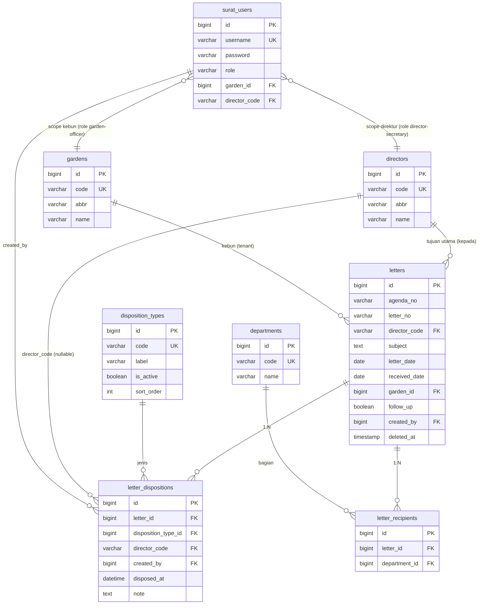

# Arsitektur Surat + Disposisi Baru

> Project: `surat-new`
> Target: satu aplikasi Laravel berdiri sendiri untuk domain Surat & Disposisi Direksi yang sebelumnya berjalan sebagai aplikasi Classic ASP terpisah (`surat/`).
> Database aplikasi: `ptpn_surat` (baru, terpisah dari `ptpn`).
> Database sumber legacy: `daddy` (SQL Server, tabel `surat`, `login`, `t_kebun`, `urusurat`, `kodir`, `suratbag`).
> Frontend: Blade + Vite + Tailwind CSS (konsisten dengan `portal-new`).
> Scope dokumen ini: **arsitektur & perencanaan saja** — belum ada implementasi kode.

---

## 1. Ringkasan arsitektur

Surat lama dibangun dengan Classic ASP/JScript, satu koneksi ADO ke database SQL Server `daddy`, session berbasis kode kebun (bukan identitas personal), dan dua sistem disposisi yang berjalan paralel tanpa sinkronisasi (lihat §5). Detail AS-IS lengkap ada di [`../db-analysis/README-SYSTEM-SURAT.md`](../db-analysis/README-SYSTEM-SURAT.md); dokumen ini hanya merangkum yang relevan untuk keputusan arsitektur.

`surat-new` **tidak** digabung ke `portal-new`. Ini sudah menjadi keputusan eksplisit di [`portal-new/readme/arsitektur.md`](../portal-new/readme/arsitektur.md) §2 ("Surat akan menjadi domain/project terpisah") dan dikonfirmasi ulang saat perencanaan ini dimulai. Alasannya:

- domain berbeda (persuratan/disposisi direksi vs SDM);
- basis pengguna berbeda (login per-kebun/unit, bukan per-pegawai personal, untuk sebagian besar peran);
- tabel inti (`surat`, 44.597 baris) sudah besar dan punya masalah data tersendiri yang butuh penanganan khusus (dua sistem disposisi paralel);
- menjaga `portal-new` tetap fokus pada fondasi SDM.

Namun kedua project **berbagi ekosistem** (server, MySQL, dan kemungkinan pool pegawai yang sama untuk Sekretaris Direksi/Admin), sehingga referensi lintas-DB dipakai **secara longgar** (lihat §6), bukan foreign key fisik — pola yang sama seperti sudah direkomendasikan di [`db-analysis/README-FINAL-SCHEMA-ERD.md`](../db-analysis/README-FINAL-SCHEMA-ERD.md) §1: *"Relasi lintas-DB ... disimpan longgar sebagai `nik`/kode, tanpa FK fisik."*

Prinsip utama:

- satu project Laravel berdiri sendiri;
- satu database target `ptpn_surat`;
- satu model disposisi terpadu menggantikan `dis1..16` + `dis_new1..18` + `D*`/`B*`/`diskabag*` yang saat ini terpecah tiga cara;
- controller tipis, Form Request untuk validasi, Action/Service untuk transaksi;
- Eloquent menggantikan seluruh SQL string-concatenation;
- Policy + role menggantikan pola *Dreamweaver "Restrict Access To Page"* (`MM_authorizedUsers`) yang statis per halaman;
- Blade + Tailwind menggantikan tampilan tabel-layout + flash header lama.

Arsitektur target:

```text
Browser
   |
   v
Laravel routes + middleware
   |
   +-- Authentication (surat_users)
   +-- EnsureActiveUser
   +-- Permission / Policy (per peran: admin, kebun, bagian, sekretaris direksi)
   +-- Tenant scope (kebun) / Director scope
   |
   v
Controller
   |
   +-- Form Request
   +-- Action / Service (mis. DisposeLetterAction, RecordAgendaNumberAction)
   |
   v
Eloquent Models
   |
   v
MySQL `ptpn_surat`
```

---

## 2. Batas scope project

### Masuk ke `surat-new` (MVP)

Fondasi:

- login/logout berbasis `surat_users` (menggantikan `login`, password di-hash);
- role: Admin, Kebun/Unit (petugas surat), Bagian/Kabag, Sekretaris Direksi (per direktur);
- dashboard ringkas per peran;
- navigasi berbasis permission (bukan hardcoded otoritas).

Surat masuk/keluar (inti, dari modul Kebun):

- input surat (`inputsurat.asp` → `letters` + relasi tujuan);
- edit surat;
- lihat/arsip surat per kebun per bulan/tahun (`lihat1.asp`);
- pencarian surat (hal/dari/nomor) — pengganti `search.asp`;
- buku agenda (`agenda.asp`/`buku.asp`);
- hapus surat (soft delete, dengan audit).

Disposisi (model terpadu — lihat §5):

- disposisi "tujuan" (direktur & bagian) — pengganti `D*`/`B*`;
- disposisi "instruksi" (satu master `disposition_types`) — pengganti `dis1..16` + `dis_new1..18`;
- form disposisi Sekretaris Direksi — pengganti `sekdirmain.asp`/`SekDir.asp`;
- arsip surat per direktur (`SDMain.asp` → daftar surat sesuai `kepada`/tujuan direktur);
- cetak lembar disposisi (pengganti `cdispa.asp`).

Surat bagian (setelah verifikasi tabel `suratbag` — lihat §7 gap):

- input/edit surat bagian (`inputsuratbag.asp`/`editsuratbag.asp` → `letter_divisions`);
- disposisi kabag (`diskabag1..9`).

Referensi/master:

- direksi (`kodir` → `directors`);
- kebun/unit (`t_kebun` → `gardens`);
- urusan/bagian (`urusurat` → `departments`);
- jenis disposisi (`disposition_types`, master tunggal, bukan hardcoded checkbox).

### Ditunda

- laporan/rekap lanjutan (statistik disposisi, evaluasi tindak lanjut > 7 hari, dsb — versi awal cukup indikator sederhana seperti `lihat1.asp` punya sekarang);
- cetak agenda/buku agenda versi PDF (`cdispa`/`buku.asp` awalnya cukup versi Blade print);
- migrasi historis penuh 44.597 baris `surat` + mapping label disposisi lama→baru (lihat §5.3) — dikerjakan sebagai tahap data migration terpisah, bukan bagian dari Fase 1 kode aplikasi;
- integrasi SSO penuh dengan `portal-new` (lihat §6) — dimulai dari referensi longgar dulu.

### Di luar scope

- Domain SDM (ditangani `portal-new`);
- EIS, keuangan/akuntansi, produksi/gudang, e-procurement, dan modul lain di luar persuratan.

---

## 3. Arsitektur legacy Surat (ringkasan AS-IS)

Detail penuh: [`db-analysis/README-SYSTEM-SURAT.md`](../db-analysis/README-SYSTEM-SURAT.md).

### 3.1 Entry dan login

File utama: `surat/loginsurat.asp`, `surat/loading.asp`, `surat/logout.asp`, `surat/ubahpass.asp`, `surat/updatepass.asp`, `surat/passurat.asp`.

```text
loginsurat.asp -> SELECT ... FROM login WHERE username=? AND password=?  (plaintext)
   -> loading.asp (router by otoritas)
        01..07          -> menudir.asp        (Sekretaris Direksi)
        2,21,22,23,24,25-> menusurat.asp      (Kebun/Unit)
        3               -> menusuratbag.asp   (Bagian/Kabag)
        1               -> admin.asp          (Admin)
```

Masalah kunci (lihat §8 untuk daftar lengkap + rencana perbaikan):

- password plaintext, kredensial DB hardcoded di `Connections/consurat.asp`;
- otorisasi berbasis whitelist string per halaman (`MM_authorizedUsers`), bukan RBAC;
- `passurat.asp` menampilkan password semua user secara plaintext ke Admin — kebocoran kredensial *by design*;
- mayoritas query lain (di luar login) merangkai `Request.QueryString`/`Session` mentah → rentan SQL injection;
- `SD.asp` adalah backdoor (`BULK INSERT` + browsing file OS) — **tidak boleh dimigrasi**.

### 3.2 Peran & shell menu

| Otoritas legacy | Peran | Shell | Target role Laravel |
|---|---|---|---|
| `1` | Admin | `admin.asp` | `admin` |
| `2`,`21`–`25` | Kebun/Unit (petugas surat) | `menusurat.asp` | `garden-officer` (scoped ke `garden_id`) |
| `3` | Bagian/Kabag | `menusuratbag.asp` | `department-head` |
| `01`–`07` | Sekretaris Direksi (per direktur) | `menudir.asp` | `director-secretary` (scoped ke `director_code`) |

Perbedaan hak akses (dari AS-IS §3c): hanya Kebun dan Bagian yang **input** surat; Sekretaris Direksi **hanya melihat** arsip yang ditujukan ke direkturnya dan mengisi disposisi.

### 3.3 Modul inti & tabel yang disentuh

| Modul legacy | Tabel | Menjadi |
|---|---|---|
| `inputsurat.asp` / `editsurat.asp` | `surat` (INSERT/UPDATE) | `LetterController@store/update` |
| `lihat1.asp` / `xlihat1.asp` (dup.) | `surat` JOIN `kodir` | `LetterController@index` (arsip per kebun) |
| `search.asp` / `searchdir.asp` / `searchadm.asp` | `surat` | `LetterController@search` (satu endpoint, scope by role) |
| `agenda.asp` + `buku.asp` | `surat` | `AgendaController@index` |
| `SDMain.asp` | `surat` (query dinamis per otoritas direktur) | `DirectorArchiveController@index` |
| `sekdirmain.asp` / `SekDir.asp` (duplikat) | `surat` (UPDATE `dis1..16`, `D*`) | `LetterDispositionController@store` |
| `cdispa.asp` | `surat` (cetak) | `LetterController@printDisposition` |
| `inputsuratbag.asp` / `editsuratbag.asp` | `suratbag` | `LetterDivisionController@store/update` |
| `checknosur.asp`, `checkno.asp`, `checknobag.asp` | `surat`/`suratbag` (validasi nomor) | validasi di Form Request + `AgendaNumberService` (hindari race condition `MAX+1`) |
| `carisurat.asp`, `lihatsurat.asp` | — | **tidak dimigrasi** (query ke kolom yang tidak ada, sudah rusak) |

File backup/duplikat (`SDMainXX/YY/ZZ/_`, `search_bu*`, `cdispa - ...`, `xlihat1.asp`) **tidak dimigrasi**.

---

## 4. Peta pemanggilan legacy (untuk referensi alur)

```text
loginsurat -> loading -> {menusurat | menudir | menusuratbag | admin}

menusurat (kebun) --> inputsurat --(INSERT surat)--> lihatinput
          |--> lihat1 --> editsurat --(UPDATE surat)--> menusurat
          |            |-> cdispa (cetak) / deletesurat
          |--> search.asp (AJAX)
          |--> agenda -> buku.asp (AJAX)
          \--> ubahpass -> updatepass (UPDATE login) -> menusurat

menudir (sekr. direksi) --> SDMain --> sekdirmain/SekDir --(UPDATE surat dis1..16,D*)--> SDMain
          \--> searchdir.asp (AJAX)

menusuratbag (kabag) --> inputsuratbag --(INSERT suratbag)--> lihatsuratbag
          \--> editsuratbag --(UPDATE suratbag)--> lihatsuratbag

admin (otoritas 1) --> passurat (lihat password plaintext — DIHAPUS) | searchadm
```

Target: setiap panah "alur" di atas menjadi route + controller action Laravel yang eksplisit (resource routes), bukan navigasi lewat `location.href` + querystring JavaScript.

---

## 5. Masalah disposisi & desain model terpadu

Ini adalah **keputusan arsitektur terpenting** di project ini — sistem lama punya tiga model disposisi yang tidak sinkron.

### 5.1 Tiga model paralel di legacy

| Model | Kolom | Diisi oleh | Dibaca di |
|---|---|---|---|
| Tujuan direktur/bagian | `D1,D12,D22,D31,D41` + `B1..B29` | Kebun (saat input) & Sekretaris (mempertegas) | `lihat1`, `search`, `SDMain`, `cdispa` |
| Instruksi "baru" (2026) | `dis_new1..dis_new18` | **Kebun** via `inputsurat`/`editsurat` | `search.asp`, `lihat1.asp` |
| Instruksi "lama" | `dis1..dis16` | **Sekretaris Direksi** via `sekdirmain`/`SekDir` | `SDMain.asp`, `cdispa.asp` |
| Disposisi bagian (ketiga) | `diskabag1..9` + `dir1..8`/`dis1..8` di `suratbag` | Kabag | modul surat bagian |

**Akibat nyata:** surat yang didisposisi Sekretaris Direksi (`dis1..16`) tidak muncul disposisinya di layar Kebun (yang hanya baca `dis_new*`), dan sebaliknya. Ditambah lagi label checkbox form ≠ label yang ditampilkan di hasil pencarian (`README-DISPOSISI.md`), dan `dis17`/`dis18` sempat tidak tersimpan sama sekali karena hilang dari string INSERT. Rincian penuh + tiga versi mapping label historis ada di [`../surat/README-DISPOSISI.md`](../surat/README-DISPOSISI.md) dan [`../surat/README-DISPOSISI-NEW.md`](../surat/README-DISPOSISI-NEW.md).

### 5.2 Desain target — satu model, dipisah per konsep

Mengadopsi rancangan awal di [`db-analysis/README-FINAL-SCHEMA-ERD.md`](../db-analysis/README-FINAL-SCHEMA-ERD.md) §3.2–3.3 dan §6 (ERD `ptpn_surat`), dengan penajaman agar dua sumber penulis (Kebun vs Sekretaris Direksi) tidak lagi bentrok:

```text
letters
  └─┬─ letter_recipients   (N:M ke departments)     -- ganti B1..B29
    └─ letter_dispositions (N:1 ke disposition_types) -- ganti dis1..16 + dis_new1..18 + D*
```

`letter_dispositions` — satu baris = satu instruksi yang dicatat oleh satu aktor, untuk satu direktur (bila relevan):

| Kolom | Keterangan |
|---|---|
| `id` | PK |
| `letter_id` | FK `letters` |
| `disposition_type_id` | FK `disposition_types` (master tunggal, label final disepakati sekali — bukan tiga versi) |
| `director_code` | nullable, FK `directors.code` — kosong bila instruksi umum dari Kebun, terisi bila spesifik ke direktur tertentu (mengganti `D1,D12,...`) |
| `created_by` (user_id) | siapa yang mencatat — **menggantikan asumsi implisit "kebun vs sekretaris" dengan data eksplisit** |
| `disposed_at` | tanggal disposisi |
| `note` | catatan bebas |

Manfaat desain ini:

- satu sumber kebenaran per surat — tidak ada lagi "disposisi hilang tergantung siapa yang melihat";
- riwayat penuh (siapa mendisposisi apa, kapan) otomatis tersedia sebagai audit trail, tanpa kolom tambahan;
- menambah jenis instruksi baru = tambah baris `disposition_types`, bukan tambah kolom (`dis19`, `dis20`, ...).

`disposition_types` perlu **satu keputusan label final** sebelum migrasi data — pilih salah satu dari 3 versi historis (rekomendasi: pakai label form input terbaru, 18 jenis di `README-DISPOSISI-NEW.md` §"DISPOSISI BARU", karena itu yang aktif dipakai user saat ini) dan dokumentasikan mapping lama→baru sebagai bagian dari migration seeder, bukan asumsi runtime.

### 5.3 Disposisi surat bagian (`letter_divisions`)

`diskabag1..9` dan `dir1..8`/`dis1..8` di `suratbag` bisa memakai struktur analog (`letter_division_dispositions` atau reuse `letter_dispositions` dengan `letter_divisions.id` sebagai `letter_id` polimorfik) — keputusan detail ditunda sampai skema `suratbag` terverifikasi (§7).

---

## 6. Model data target — DB `ptpn_surat`

Mengadopsi dan merinci [`db-analysis/README-FINAL-SCHEMA-ERD.md`](../db-analysis/README-FINAL-SCHEMA-ERD.md) §3 & §6.

### 6.1 Tabel inti

```text
letters                  (dari `surat`)
letter_recipients        (dari B1..B29, N:M ke departments)
letter_dispositions      (dari dis1..16 + dis_new1..18 + D*, lihat §5.2)
letter_divisions         (dari `suratbag`, pending verifikasi)
```

### 6.2 Master/referensi

```text
directors    (dari `kodir`)
departments  (dari `urusurat`)
gardens      (dari `t_kebun`)
disposition_types  (master baru, menggantikan hardcoded checkbox)
```

### 6.3 Auth

```text
surat_users  (dari `login`, password di-hash, role = otoritas lama dipetakan ke role Laravel)
```

### 6.4 ERD



### 6.5 Referensi lintas-DB ke `ptpn` (portal-new)

Tanpa foreign key fisik (beda database/koneksi), tapi dipetakan secara aplikatif dan didokumentasikan sebagai konvensi kode:

| Entitas `ptpn_surat` | Kemungkinan referensi di `ptpn` | Cara pemetaan | Kapan dipakai |
|---|---|---|---|
| `gardens.code` | `units.code` (kebun/unit di SDM) | pencocokan kode, di-cache/di-sync via job berkala | laporan gabungan, dropdown terpadu |
| `surat_users` (role `director-secretary`/`admin`) | `employees.nik` | tambahkan kolom `surat_users.nik` nullable, isi manual saat provisioning akun personal | akuntabilitas personal Sekretaris Direksi & Admin — bukan wajib di MVP |
| `directors.code` | jabatan direksi di `employees`/`positions` | manual mapping table kecil, bukan FK | opsional, untuk menampilkan nama direktur terkini otomatis |

**Keputusan MVP:** `surat_users` tetap independen (login per-kebun untuk Kebun/Bagian, sesuai realitas legacy — akun dipakai bersama satu unit, bukan personal). Kolom referensi `nik`/`unit code` ditambahkan sebagai *nullable enrichment*, bukan syarat login. Integrasi SSO penuh (satu identitas Laravel Passport/session lintas `portal-new` dan `surat-new`) didorong ke tahap "Future" — sama seperti disebut di `portal-new/readme/arsitektur.md` §15.

### 6.6 Koreksi (2026-09-15): `gardens` bukan tenant scope — itu master label pengirim

Verifikasi langsung ke data (`arsitektur-surat-lama.md` §6.2) menunjukkan asumsi awal salah: `surat.kebun` (dipakai di seluruh `WHERE kebun = Session(...)`) **bukan** kode dari `t_kebun`, melainkan **username personal** — hanya 6 nilai historis (`herman`, `suparno`, `erlian`, `irma`, `nelfi`, `holding`), semuanya cocok dengan `login.username` role `21`–`25`. Sebaliknya, `t_kebun` (94 baris) isinya nama jabatan/unit pengirim (`KEPALA BAGIAN UMUM (BUMU)`, `DIREKTUR PRODUKSI DAN PENGEMBANGAN (DPP)`, dst.) yang muncul di kolom **`dari`**, bukan `kebun`.

**Revisi desain §6.1–§6.4:**

- `gardens` diganti peran menjadi **`sender_units`** (atau nama serupa) — murni master label untuk field `dari` pada `letters`, **bukan** FK penentu kepemilikan/scope data.
- Tenant scope surat kebun sepenuhnya mengikuti `letters.created_by` → `surat_users.id` (akun individual), **bukan** `garden_id`. Policy `garden-officer` di §8/§10 discope ke *"surat milik akun saya sendiri"*, bukan *"surat milik unit saya"*.
- ERD §6.4 baris `gardens ||--o{ letters : "kebun (tenant)"` dan kolom `letters.garden_id` perlu diubah jadi `letters.sender_unit_id` (nullable, referensi label saja) — tidak dipakai untuk scoping/Policy.
- Implikasi: hanya perlu menyiapkan akun personal untuk ±9 pengguna yang terbukti aktif di sisi kebun (lihat §7 poin 7), bukan menyiapkan 94 "akun kebun".

---

## 7. Gap & hal yang wajib diverifikasi sebelum coding

Dari [`README-SYSTEM-SURAT.md`](../db-analysis/README-SYSTEM-SURAT.md) §1 & §8. Status per 2026-09-15: seluruh gap di bawah **sudah diverifikasi langsung ke database MySQL lokal** (`db_ptpn_3`) — detail lengkap query & angka di [`arsitektur-surat-lama.md`](./arsitektur-surat-lama.md) §6.

1. ~~Tabel `suratbag` belum dikonfirmasi~~ **RESOLVED — ADA**, 19.045 baris. Kolom disposisinya lebih lebar dari yang dipakai kode: `diskabag1..16` (bukan hanya `..9`) dan `dis1..16` (bukan hanya `..8`).
2. ~~Tabel `kodir` tidak terdokumentasi~~ **RESOLVED — ADA**, 13 baris (kode `1,11,12,2,21,22,3,31,4,41,5,51,6`). **Catatan baru:** kode `7` (DIRKORP) tidak punya baris master dan tidak pernah terisi di `surat.D7`/`kepada` (0 baris) — kolom ini dianggap tidak pernah benar-benar dipakai, jangan ikut di-seed sebagai `directors` aktif.
3. ~~Ketidakcocokan jumlah kolom `dis_new*`~~ **RESOLVED — terkonfirmasi 19 kolom** (`dis_new1..19`). `dis_new19` ada di skema tapi tidak dipakai/dirender di file manapun yang dianalisis — perlu klarifikasi makna sebelum dimasukkan ke seed `disposition_types` final.
4. **Kolom `t_kebun.NamaKebun`/`Group2`/`Group3`** — belum diverifikasi pemakaiannya secara spesifik, masih perlu dicek saat desain migrasi kolom.
5. ~~`doc_lelang` di luar scope~~ **RESOLVED — dikonfirmasi**, 5 baris saja, domain lelang terpisah, tetap di luar scope `surat-new`.
6. **BARU — koreksi model tenant/scope (lihat §6.6):** `surat.kebun` bukan kode kebun/unit dari `t_kebun`, melainkan username personal petugas (hanya 6 nilai distinct: herman, suparno, erlian, irma, nelfi, holding). `t_kebun` (94 baris) sebenarnya adalah master label unit pengirim untuk kolom `dari`, bukan penentu tenant scope. Model `gardens` di §6 perlu ditinjau ulang — lihat §6.6.
7. **BARU — realitas pemakaian akun jauh lebih sempit dari jumlah baris `login`:** dari 83 akun berotoritas `3` (Bagian/Kabag), hanya 5 pernah menginput data, dan 1 akun (`3.12`) menyumbang 99,8% dari 19.045 baris `suratbag`. Jangan asumsikan seluruh akun `login` perlu migrasi sebagai user aktif — verifikasi daftar akun benar-benar aktif ke pemilik bisnis sebelum Fase 5.
8. **BARU — kredensial trivial:** 84 dari 102 akun (82%) punya password **identik** dengan username (mis. user `3.01` password `3.01`), plus ditemukan 2 baris `login` duplikat persis untuk username `3.00`. Tidak ada nilai kredensial lama yang layak dibawa (di-hash ulang pun percuma) — Fase 5 wajib reset password paksa untuk semua akun, dan bersihkan duplikat sebelum migrasi.

---

## 8. Risiko & aturan migrasi kode

### Risiko legacy (ringkasan dari AS-IS §8)

1. Disposisi terpecah tiga model tanpa sinkronisasi (§5).
2. Query mati merujuk kolom yang tidak ada (`carisurat.asp`, `lihatsurat.asp`) — jangan diporting.
3. Gap tabel `suratbag` — konfirmasi dulu (§7).
4. SQL injection di hampir semua query selain login (query merangkai `Request.QueryString`/`Session` mentah).
5. Kredensial database & password user plaintext; `passurat.asp` membocorkan password semua user ke Admin.
6. Backdoor `SD.asp` (`BULK INSERT` + file browsing OS) — hapus total, jangan dimigrasi.
7. Tidak ada PK/index eksplisit; semua flag `dis*`/`B*`/`D*` bertipe varchar "1"/kosong.
8. Multi-tenant hanya lewat filter `WHERE kebun='<Session>'` di setiap query — rentan salah filter kalau ada query yang lupa menambahkannya.
9. Banyak file backup/duplikat tercampur di root (`SDMainXX`, `search_bu*`, `xlihat1.asp`, dst).

### Aturan target (konsisten dengan `portal-new`)

- semua akses data lewat Eloquent/query builder — tidak ada string concatenation SQL;
- create = POST, update = PUT/PATCH, delete = DELETE (tidak ada state change lewat GET seperti `updatepass.asp?p=...`);
- CSRF di semua form;
- validasi di Form Request, otorisasi di Policy;
- password di-hash (Laravel `Hash`), kredensial DB di `.env`;
- tenant scope (`garden_id` untuk Kebun, `director_code` untuk Sekretaris Direksi) diterapkan lewat **global scope/Policy**, bukan filter manual di tiap controller;
- nomor agenda (pengganti `checkno.asp` `MAX+1`) memakai service transaksional dengan locking, untuk hindari race condition saat dua kebun input bersamaan;
- `passurat.asp` dan `SD.asp` **tidak dimigrasi sama sekali**;
- setiap aksi disposisi dicatat sebagai baris baru (audit trail otomatis dari desain §5.2), bukan overwrite kolom.

---

## 9. Target struktur aplikasi Laravel

Mengikuti pola yang sudah dipakai di `portal-new` untuk konsistensi tim:

```text
surat-new/
├── app/
│   ├── Actions/
│   │   ├── Letters/          (CreateLetterAction, DisposeLetterAction, ...)
│   │   └── Agenda/           (AllocateAgendaNumberAction)
│   ├── Http/
│   │   ├── Controllers/
│   │   │   ├── Auth/
│   │   │   ├── Letters/      (LetterController, LetterDispositionController)
│   │   │   ├── LetterDivisions/ (setelah suratbag terverifikasi)
│   │   │   ├── References/   (DirectorController, DepartmentController, GardenController, DispositionTypeController)
│   │   │   └── System/       (RoleController, UserController)
│   │   ├── Middleware/       (EnsureActiveUser, ResolveGardenScope, ResolveDirectorScope)
│   │   └── Requests/
│   ├── Models/
│   ├── Policies/
│   └── Services/
│       └── Agenda/
├── database/
│   ├── migrations/
│   ├── seeders/              (DispositionTypeSeeder — label final, lihat §5.2)
│   └── sql/
├── readme/
│   └── arsitektur.md         (dokumen ini)
├── resources/
│   ├── css/ js/
│   └── views/
│       ├── auth/
│       ├── letters/
│       ├── dispositions/
│       ├── references/
│       └── layouts/
├── routes/
└── tests/
```

---

## 10. Otorisasi & navigasi target

Permission awal (contoh, disesuaikan saat implementasi):

```text
letters.view-own-garden
letters.view-department
letters.view-director
letters.view-all
letters.create
letters.update
letters.delete
letters.dispose
letter-divisions.manage
references.manage
admin.users
admin.roles
```

Scope data:

```text
own garden (Kebun)     -> WHERE garden_id = scope
own department (Bagian)-> WHERE department terkait
own director (Sekr.)   -> WHERE director_code = scope OR ada di letter_recipients/letter_dispositions
corporate all (Admin)
```

Navigasi target:

```text
Dashboard

Surat
├── Input Surat          (Kebun, Bagian)
├── Arsip Surat          (per kebun / per direktur, sesuai role)
├── Pencarian Surat
├── Buku Agenda
└── Disposisi

Surat Bagian             (setelah suratbag terverifikasi)
├── Input Surat Bagian
└── Arsip Surat Bagian

Data Referensi
├── Direksi
├── Kebun/Unit
├── Bagian/Urusan
└── Jenis Disposisi

Administrasi Sistem
├── Users
├── Roles
└── Audit Logs

Profil
├── Ganti Password
└── Logout
```

Menu di-render berdasarkan permission; akses URL tetap dilindungi middleware + Policy (menyembunyikan menu bukan kontrol keamanan).

---

## 11. Fase implementasi

### Fase 0 — baseline & safety
- dokumentasi arsitektur (dokumen ini);
- verifikasi gap §7 (`suratbag`, `kodir`, jumlah kolom `dis_new*`);
- putuskan label final `disposition_types` (§5.2);
- setup project Laravel baru, `.env` ke `ptpn_surat`;
- baseline schema, backup `daddy` sebelum migrasi apa pun.

### Fase 1 — auth & read-only
- model & migrasi tabel master (`directors`, `departments`, `gardens`, `disposition_types`);
- login/logout `surat_users`, role mapping dari `login.otoritas`;
- dashboard per peran;
- arsip surat read-only (`lihat1`, `SDMain` setara) + pencarian.

### Fase 2 — input & disposisi
- input/edit surat (Kebun);
- model disposisi terpadu (`letter_recipients`, `letter_dispositions`);
- form disposisi Sekretaris Direksi;
- agenda number service (anti race-condition);
- buku agenda.

### Fase 3 — surat bagian & cetak
- modul `letter_divisions` (setelah `suratbag` terverifikasi);
- cetak lembar disposisi (Blade print, PDF menyusul);
- laporan sederhana (evaluasi tindak lanjut, dsb).

### Fase 4 — migrasi data historis
- migrasi 44.597 baris `surat` ke `letters`;
- mapping `dis1..16` + `dis_new1..18` → `letter_dispositions` sesuai keputusan label final (audit trail per baris, bukan overwrite);
- migrasi `B*`/`D*` → `letter_recipients`/`letter_dispositions.director_code`;
- rekonsiliasi jumlah data (mis. verifikasi ulang teknik di `MIGRASI-DISPOSISI-2026.sql` tapi ke skema baru, bukan ALTER TABLE di tempat).

### Fase 5 — cut-over
- UAT paralel legacy vs Laravel per peran (Kebun, Bagian, Sekretaris Direksi, Admin);
- freeze write ke `daddy`;
- reset password `surat_users` (tidak boleh bawa plaintext lama);
- production cut-over;
- hapus akses ke `SD.asp`/`passurat.asp` legacy sebelum decommission.

### Future
- integrasi referensi lebih erat dengan `ptpn` (portal-new) — lihat §6.5;
- SSO lintas aplikasi jika `portal-new` sudah menjadi authorization server.

---

## 12. Sumber referensi

Dokumen:

- [`../db-analysis/README-SYSTEM-SURAT.md`](../db-analysis/README-SYSTEM-SURAT.md) — dokumentasi AS-IS lengkap;
- [`../db-analysis/README-FINAL-SCHEMA-ERD.md`](../db-analysis/README-FINAL-SCHEMA-ERD.md) §3, §6 — rancangan awal skema `ptpn_surat`;
- [`../db-analysis/README.md`](../db-analysis/README.md) — analisis tabel `daddy`;
- [`../surat/README-DISPOSISI.md`](../surat/README-DISPOSISI.md) — ketidaksesuaian label disposisi;
- [`../surat/README-DISPOSISI-NEW.md`](../surat/README-DISPOSISI-NEW.md) — strategi dual-column & mapping lama→baru;
- [`../surat/MIGRASI-DISPOSISI-2026.sql`](../surat/MIGRASI-DISPOSISI-2026.sql) — referensi query migrasi kolom (untuk dipetakan ulang ke skema baru, bukan dijalankan apa adanya);
- [`../portal-new/readme/arsitektur.md`](../portal-new/readme/arsitektur.md) — pola arsitektur & struktur project acuan.

File legacy utama:

- `../surat/loginsurat.asp`, `loading.asp`, `logout.asp`;
- `../surat/menusurat.asp`, `menudir.asp`, `menusuratbag.asp`;
- `../surat/inputsurat.asp`, `editsurat.asp`, `lihat1.asp`, `search.asp`, `agenda.asp`;
- `../surat/SDMain.asp`, `sekdirmain.asp`, `SekDir.asp`, `cdispa.asp`;
- `../surat/inputsuratbag.asp`, `editsuratbag.asp`, `checknobag.asp`.

---

## 13. Definition of done fondasi

Fondasi dianggap selesai jika:

1. Laravel terhubung ke `ptpn_surat` tanpa mengubah data `daddy` yang masih hidup.
2. Gap §7 (suratbag, kodir, jumlah kolom dis_new) sudah diverifikasi dan didokumentasikan.
3. Login `surat_users` bekerja dengan password ter-hash; tidak ada password plaintext yang dibawa ke production.
4. Role Admin/Kebun/Bagian/Sekretaris Direksi terpasang lewat RBAC, bukan whitelist string per halaman.
5. Model disposisi terpadu (`letter_recipients` + `letter_dispositions`) berjalan untuk input Kebun **dan** Sekretaris Direksi tanpa kehilangan visibilitas data di kedua sisi.
6. Tidak ada query string-concatenation; semua lewat Eloquent/parameter binding.
7. Tidak ada state change lewat GET; semua form pakai CSRF.
8. `SD.asp` dan `passurat.asp` tidak memiliki padanan di `surat-new`.
9. Menu dan akses URL sama-sama dilindungi permission (tidak hanya menu yang disembunyikan).
10. Rencana migrasi data historis (Fase 4) dan mapping label disposisi final sudah disepakati sebelum kode migrasi data ditulis.

---

## 14. Hasil migrasi data Fase 4 (2026-09-15)

Skema final berbeda dari rancangan awal §6 dalam satu hal: flag target direktur tambahan (`D1..D41` di `surat`, `dir1..8` di `suratbag`) TIDAK dimasukkan ke `letter_dispositions`/`letter_division_dispositions` (kolom `director_id` dihapus dari kedua tabel itu) — sebagai gantinya dipisah ke dua tabel pivot baru `letter_director_recipients` dan `letter_division_director_recipients`, sejajar konsepnya dengan `letter_recipients` (department). Alasan: D*/dir* adalah "siapa lagi yang dituju", bukan "jenis instruksi", jadi tidak cocok dipaksa ke tabel disposisi.

`disposition_types` diseed 34 baris, bukan 18: 18 aktif (label final `dis_new1..18`) + 16 nonaktif (`legacy_dis1..16`, label asli form `sekdirmain.asp`/`inputsuratbag.asp` — dikonfirmasi identik untuk `dis1..16` DAN `diskabag1..16`). Keputusan ini diambil karena 11 dari 16 label lama (mis. BDS, DIPEDOMANI, ARSIP, DIEVALUASI) tidak punya padanan aktif yang jujur — dipaksakan ke label baru akan mendistorsi makna data historis.

ETL dijalankan via 3 Artisan command (`legacy:migrate-references`, `legacy:migrate-letters`, `legacy:migrate-divisions`) membaca langsung dari koneksi `legacy` (`db_ptpn_3`, read-only). Hasil akhir (baris identik dengan jumlah sumber, tidak ada data hilang):

| Tabel | Baris | Catatan |
|---|---|---|
| `surat_users` | 102 | 101 dari `login` (1 duplikat `3.00` di-skip) + 1 akun sistem `legacy-migration`. Password di-generate acak & `must_change_password=true` untuk semua — tidak ada nilai lama yang dibawa (lihat §7 poin 8). |
| `directors` | 13 | 1:1 dari `kodir`. |
| `departments` | 29 | Diseed dari label checkbox B1-B29 di `inputsurat.asp`, bukan dari tabel legacy manapun (tidak ada masternya di legacy). |
| `sender_units` | 94 | 1:1 dari `t_kebun`. |
| `disposition_types` | 34 | 18 aktif + 16 legacy nonaktif (lihat penjelasan di atas). |
| `letters` | 33.978 | 1:1 dari `surat` — cocok persis dengan hitungan legacy. |
| `letter_recipients` | 31.383 | Dari flag `B1..B29` yang bernilai `1`. |
| `letter_director_recipients` | 28.543 | Dari flag `D1..D41`. 1 baris `kepada` tidak terpetakan (kode direktur tidak ada di master — kemungkinan data kotor). |
| `letter_dispositions` | 73.027 | Gabungan `dis_new1..18` (aktor = pembuat surat) + `dis1..16` (aktor = akun sistem `legacy-migration`, karena Sekretaris Direksi spesifik tidak tercatat di legacy — lihat §5.2). |
| `letter_divisions` | 19.045 | 1:1 dari `suratbag` — cocok persis. 29 baris `created_by` fallback ke akun sistem (`nama`/username tidak match). |
| `letter_division_dispositions` | 27.589 | 25.275 dari `diskabag1..16` (aktor Kabag, diketahui) + 2.314 dari `dis1..16` (aktor akun sistem). |
| `letter_division_director_recipients` | 2.236 | Dari `dir1..8`. 4 baris tidak terpetakan (kode `7`/DIRKORP, tidak ada di master `directors` — konsisten dengan temuan §7 poin 2). |

Catatan penting yang ditemukan selama ETL (bukan bug ETL, temuan data):
- **95% `letters.sender_unit_id` tidak resolve ke `sender_units`** (31.766 dari 33.978) — dikonfirmasi karena `surat.dari` memang teks bebas mencakup pengirim EKSTERNAL (mis. "GUBERNUR SUMATERA UTARA", "GKPI JEMAAT MANDALA...", "CV. REZEKI ANANDA...") yang sama sekali tidak berhubungan dengan `t_kebun`. Ini mengoreksi/mempertegas §6.6: `sender_units` perannya memang minor, sebagian besar data pakai `sender_name` (teks bebas).
- `suratbag.urusan` ternyata sudah berupa teks nama urusan dipisah koma (bukan kode `urusurat.kode`), jadi kolom `letter_divisions.matter` diisi langsung tanpa perlu resolve lewat tabel `urusurat`.

Command ETL bisa dijalankan ulang kapan saja dengan flag `--fresh` (mengosongkan tabel domain dulu) karena semuanya idempotent dan hanya membaca dari koneksi `legacy`, tidak pernah menulis ke sana.

---

## 15. Fondasi login & admin (2026-09-15)

Implementasi pertama di luar skema/data: autentikasi + RBAC + panel admin minimal. Detail teknis (bukan sekadar rencana — sudah berjalan & ditest).

### 15.1 RBAC — spatie/laravel-permission (v6.25, sama seperti `portal-new`)

- Role **tidak** disimpan sebagai kolom string di `surat_users` — sepenuhnya dikelola Spatie (`roles`, `model_has_roles`, dst) supaya tidak ada dua sumber kebenaran. Kolom `director_id`/`department_id` tetap ada di `surat_users` karena itu **scope data**, bukan peran itu sendiri (role "director-secretary" saja tidak cukup untuk tahu direktur mana yang dilayani).
- 4 role diseed via `RolePermissionSeeder`: `admin` (semua permission), `garden-officer`, `department-head`, `director-secretary` — permission list sesuai §10.
- **Gap desain yang diperbaiki saat implementasi:** `director-secretary` awalnya satu-satunya role dengan kolom scope (`director_id`); `department-head` tidak ada padanannya. Ditambahkan `surat_users.department_id` (nullable FK `departments`) — tapi berbeda dari `director_id`, ini **tidak bisa diresolve otomatis** dari `login` legacy (tidak ada kolom departemen di sana) sehingga tetap kosong untuk seluruh akun hasil migrasi sampai diisi manual lewat admin.
- **Bug yang ditemukan & diperbaiki:** `DatabaseSeeder` awalnya memakai trait `WithoutModelEvents` (default Laravel). Ini mematikan event `saved`/`deleted` yang dipakai Spatie untuk auto-invalidate cache permission, menyebabkan `PermissionDoesNotExist` palsu saat `syncPermissions()` — permission sudah ada di DB tapi cache registrar belum tahu. Diperbaiki dengan menghapus trait itu dan menambah `forgetCachedPermissions()` eksplisit setelah loop `Permission::create()`.

### 15.2 Autentikasi

- Satu guard (`web` → `SuratUser`), login berbasis **username** (bukan email) — `config/auth.php` di-rewire penuh dari default Laravel (provider, password broker, tabel `password_reset_tokens` diganti primary key `username`).
- **Tidak ada reset password via email** — `surat_users` tidak punya kolom email by design (lihat §6.3). Satu-satunya jalur reset adalah admin (`Admin\UserController::resetPassword`), generate password acak baru, ditampilkan sekali lewat flash message, tidak pernah disimpan/ditampilkan lagi setelahnya.
- `EnsureActiveUser` middleware (global, di grup `web`) mengecek `is_active` di **setiap request**, bukan hanya saat login — akun yang dinonaktifkan di tengah sesi langsung ter-logout di request berikutnya. Diverifikasi lewat test (`test_active_user_deactivated_mid_session_is_logged_out_on_next_request`).
- `EnsurePasswordChanged` middleware memaksa ganti password di login pertama (`must_change_password=true`, default untuk **seluruh** akun hasil migrasi — lihat §7 poin 8) sebelum bisa mengakses rute manapun selain halaman ganti password itu sendiri.

### 15.3 Admin panel minimal

- `Admin\UserController`: list (search + pagination), create/edit pakai **satu view `form.blade.php`** (bukan create/edit terpisah), reset password, dan "hapus" yang sebenarnya **menonaktifkan** (`is_active=false`) — bukan physical delete, karena `created_by` di `letters`/`letter_divisions`/dispositions merujuk ke akun ini (menghapus fisik akan merusak riwayat data, sesuai prinsip §9).
- `Admin\RoleController`: matrix sederhana role × permission (checkbox), untuk ubah kombinasi permission tanpa deploy kode. Daftar role sendiri tetap tetap dari seeder, tidak bisa ditambah/hapus lewat UI ini.
- Layout: Blade + Tailwind v4 (`@tailwindcss/vite`, bukan CDN) + Alpine.js + SweetAlert2 + Toastr — subset dari stack `portal-new` (jQuery/DataTables/Select2/Flatpickr belum diinstal, menyusul saat modul Surat/tabel data mulai dibangun). Palet emerald+slate mengikuti `portal-new` untuk konsistensi visual lintas aplikasi PTPN.

### 15.4 Test coverage

`tests/Feature/LoginFlowTest.php` (7 test, HTTP-level lewat `RefreshDatabase`, bukan sekadar baca kode):
1. Guest diarahkan ke `/login`.
2. Login valid → wajib ganti password dulu → dashboard bisa diakses setelah ganti password.
3. Login dengan password salah ditolak.
4. Akun `is_active=false` tidak bisa login.
5. Akun yang dinonaktifkan di tengah sesi ter-logout otomatis di request berikutnya.
6. Non-admin dapat 403 di rute admin.
7. Admin bisa membuat user baru lengkap dengan role ter-assign.

**Catatan lingkungan:** ekstensi `pdo_sqlite` tidak aktif di PHP lokal ini, jadi `phpunit.xml` diarahkan ke database MySQL terpisah (`ptpn_surat_testing`, bukan `ptpn_surat` dev) alih-alih SQLite in-memory default Laravel — `RefreshDatabase` migrasi ulang setiap run, aman dipisah dari data dev/legacy.

---

## 16. Fase 2 & 3 — input, disposisi, surat bagian, cetak, laporan (2026-09-21)

Seluruh item kode di Fase 2 dan Fase 3 (§11) selesai diimplementasikan & ditest (38 test lolos total). Fase 5 (cut-over) sengaja belum disentuh — itu aksi produksi (freeze `daddy`, reset password massal, go-live) yang butuh keputusan bisnis eksplisit, bukan pekerjaan coding.

### 16.1 AgendaNumberService — anti race-condition, dua domain

Tabel baru `agenda_counters` (`domain`, `letter_type`, `year`, `last_number`) menggantikan `showlastnum()`/`agen()` lama yang menghitung `MAX(noagenda)+1` di client-side tanpa lock. `AgendaNumberService::next()` (domain `letter`) dan `::nextForDivision()` (domain `division`) mengunci baris counter lewat `lockForUpdate()` dalam transaksi. Baris counter pertama per kombinasi di-seed dari `MAX(agenda_no)` data existing (termasuk hasil migrasi historis Fase 4) supaya tidak tabrakan dengan nomor tahun berjalan yang sudah dipakai.

Domain dipisah karena `letters.letter_type` (I-V) dan `letter_divisions.agenda_type_code` (mis. "SP-III") adalah ruang kode independen — tanpa kolom `domain`, kode yang kebetulan sama di kedua tabel akan berbagi satu counter.

### 16.2 Input/edit surat (Kebun) — `LetterController`

Form input **sengaja tidak** menyertakan checkbox instruksi disposisi (beda dari `inputsurat.asp` lama yang mencampur semuanya jadi satu form) — itu alur terpisah, lihat 16.3. `letter_type` dan `agenda_no` dikunci begitu surat dibuat (tidak bisa diubah lewat edit) supaya tidak merusak integritas counter. Otorisasi update memeriksa **kepemilikan** (`created_by === user.id`), bukan cuma permission `letters.update` secara umum — garden-officer tidak bisa edit surat officer lain meski sama-sama punya permission itu.

### 16.3 Disposisi — `LetterDispositionController` + trait `ScopesLetterVisibility`

Instruksi disposisi (dulu checkbox `dis_new1..18`) jadi alur terpisah dari input surat, ditambahkan oleh pemilik surat atau Sekretaris Direksi (permission `letters.dispose`) — satu submit bisa membuat beberapa baris `letter_dispositions` sekaligus. Kepala Bagian sengaja tidak diberi akses ke sini (mereka kelola `letter_divisions` secara terpisah, lihat 16.5).

Logika scoping visibilitas surat (`letters.view-own-garden/department/director/all`) diekstrak dari `LetterController` ke trait `ScopesLetterVisibility` supaya dipakai bersama oleh `LetterController`, `LetterDispositionController`, `AgendaBookController`, `ReportController`, dan halaman cetak — disposisi/cetak/laporan hanya bisa menyentuh surat yang boleh dilihat user. Basis query scoping pakai kondisi mustahil (`whereRaw('1 = 0')`) sebelum di-`orWhere`-kan per permission, supaya user tanpa izin view apapun tidak diam-diam melihat semua data (closure `where()` kosong di Laravel = tidak ada filter sama sekali).

### 16.4 Buku Agenda — `AgendaBookController`

Register surat diurutkan numerik per No. Agenda (`CAST(agenda_no AS UNSIGNED)`), dikelompokkan per jenis — beda dari Arsip Surat yang diurutkan tanggal terima untuk pencarian. Backend lama (`buku.asp`, dipanggil AJAX dari `agenda.asp`) sudah tidak ada di source aplikasi lama (file hilang), dan dropdown "Kode Agenda" di `agenda.asp` (nilai `1,2,3A,3B,4,F1-F4`) tidak cocok dengan `letter_type` saat ini (`I-V`) — kemungkinan peninggalan era sistem berbeda (lihat `arsitektur-surat-lama.md` §5 soal tiga era restrukturisasi). Diimplementasikan versi bersih memakai skema `letter_type` yang berlaku sekarang, bukan replikasi persis.

### 16.5 Surat Bagian — `LetterDivisionController` + `LetterDivisionDispositionController`

Menggantikan `inputsuratbag.asp`/`editsuratbag.asp`. Berbeda dari `letters`, tidak ada scoping per-record di sini — seluruh route `letter-divisions.*` digerbangi permission `letter-divisions.manage` (Kepala Bagian/admin saja), karena skema `letter_divisions` memang tidak punya kolom scoping per bagian (`department_head` cuma field teks bebas, bukan FK — lihat migration). `LetterDivisionDispositionController` mengunci `actor_role='department-head'` karena route-nya sudah digerbangi permission yang sama; jalur disposisi Direksi (`actor_role='director-secretary'`, padanan `dis1..16` legacy di alur suratbag) **sengaja belum dibuat** — permission model saat ini tidak memberi `director-secretary` akses baca ke `letter_divisions` sama sekali, jadi menambah jalur tulis tanpa jalur baca tidak berguna. Menyusul kalau kebutuhan itu muncul.

### 16.6 Cetak lembar disposisi — `letters/print.blade.php`

Halaman print-friendly berdiri sendiri (tidak `@extends('layouts.app')`, tidak ada sidebar/topbar) meniru struktur formulir fisik `cdispa.asp` lama (kotak centang Kepada/Bagian/Disposisi dengan border tabel), tapi checkbox-nya diturunkan dari relasi data aktual (`directorRecipients`/`departmentRecipients`/`dispositions`), bukan flag kolom manual yang bisa tidak sinkron. PDF generation belum ditambahkan — print-to-PDF bawaan browser dianggap cukup untuk kebutuhan awal, menyusul kalau ada kebutuhan cetak massal/terjadwal.

### 16.7 Laporan evaluasi tindak lanjut — `ReportController`

Daftar surat `follow_up=false` diurutkan dari yang paling lama menunggu, dengan ringkasan jumlah yang sudah ≥ 7 hari — menggantikan highlight merah manual di `lihat1.asp` yang cuma kelihatan kalau scroll seluruh arsip satu per satu.

### 16.8 Field yang diperbaiki saat implementasi

`letters.follow_up` sempat terkunci permanen ke `false` di draf awal `LetterController` (field ada di skema tapi tidak ada jalur UI untuk mengubahnya). Ditambahkan sebagai radio button di form edit (bukan create, karena surat baru selalu mulai "Belum Ditindaklanjuti").
